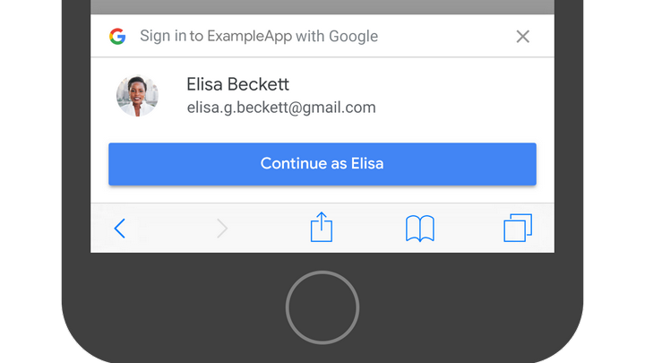

# Google One Tap Login

## Demo (Nextjs): [https://google-one-tap-taupe.vercel.app](https://google-one-tap-taupe.vercel.app/)

<p align="center">

</p>

Sign up users with a single tap and keep them signed in automatically.

## Install

```
npm install google-one-tap --save
```

## How to use

### **React**

```js
import googleOneTap from 'google-one-tap';

const options = {
	client_id: '___CLIENT_ID___', // required
	auto_select: false, // optional
	cancel_on_tap_outside: false, // optional
	context: 'signin', // optional
};

googleOneTap(options, (response) => {
	// Send response to server
	console.log(response);
});
```

### **Vue**

```js
import googleOneTap from 'google-one-tap';
export default {
	mounted() {
		const options = {
			client_id: '___CLIENT_ID___', // required
			auto_select: false, // optional
			cancel_on_tap_outside: false, // optional
			context: 'signin', // optional
		};
		googleOneTap(options, (response) => {
			// Send response to server
			console.log(response);
		});
	},
};
```

## Options

| Name                  | Type    | Required |                                     Description                                      |
| --------------------- | ------- | :------: | :----------------------------------------------------------------------------------: |
| client_id             | String  |   true   |                             Your application's client ID                             |
| auto_select           | Boolean |  false   |                             Enables automatic selection.                             | null |
| cancel_on_tap_outside | Boolean |  false   |              Cancels the prompt if the user clicks outside the prompt.               |
| context               | String  |  false   | The title in the One Tap prompt. <br />Allowed parameters: "_signin_", "_signup_", "_use_" |
| login_uri	               | URL  |  false   | The URL of your login endpoint. <br/>The Sign In With Google button redirect UX mode uses this attribute. |
| prompt_parent_id	               | String  |  false   | The DOM ID of the One Tap prompt container element |
| nonce	               | String  |  false   | A random string for ID tokens |
| state_cookie_domain		               | String  |  false   | If you need to call One Tap in the parent domain and its subdomains, <br />pass the parent domain to this field so that a single shared cookie is used. |
| ux_mode		               | String  |  false   | The Sign In With Google button UX flow <br/> Allowed parameters: "_redirect_", "_popup_" |
| allowed_parent_origin	               | String-Array  |  false   | The origins that are allowed to embed the intermediate iframe. <br/>One Tap will run in the intermediate iframe mode if this field presents. |
| itp_support	               | Boolean  |  false   | Enables upgraded One Tap UX on ITP browsers. |

## Server

Using one of the Google API Client Libraries (e.g. Java, Node.js, PHP, Python) is the recommended way to validate Google ID tokens in a production environment.

```
npm install google-auth-library --save
```

### **Node.js**

```js
const { OAuth2Client } = require('google-auth-library');
const client = new OAuth2Client(CLIENT_ID);
async function verify() {
	const ticket = await client.verifyIdToken({
		idToken: token,
		audience: CLIENT_ID, // Specify the CLIENT_ID of the app that accesses the backend
		// Or, if multiple clients access the backend:
		//[CLIENT_ID_1, CLIENT_ID_2, CLIENT_ID_3]
	});
	const payload = ticket.getPayload();
	const userid = payload['sub'];
	// If request specified a G Suite domain:
	// const domain = payload['hd'];
}
verify().catch(console.error);
```
